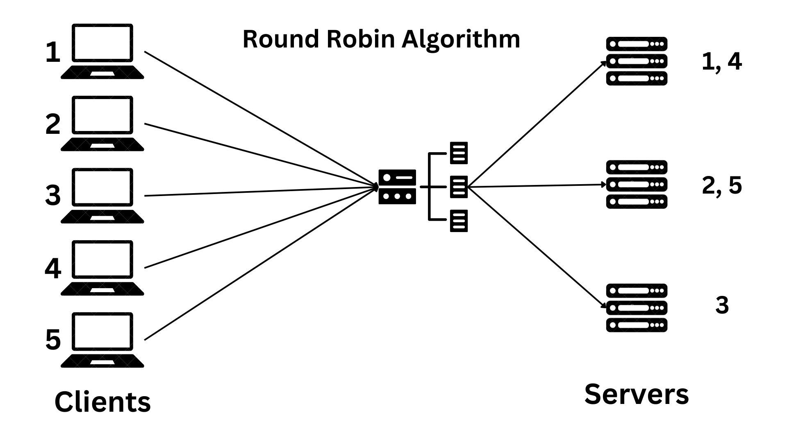
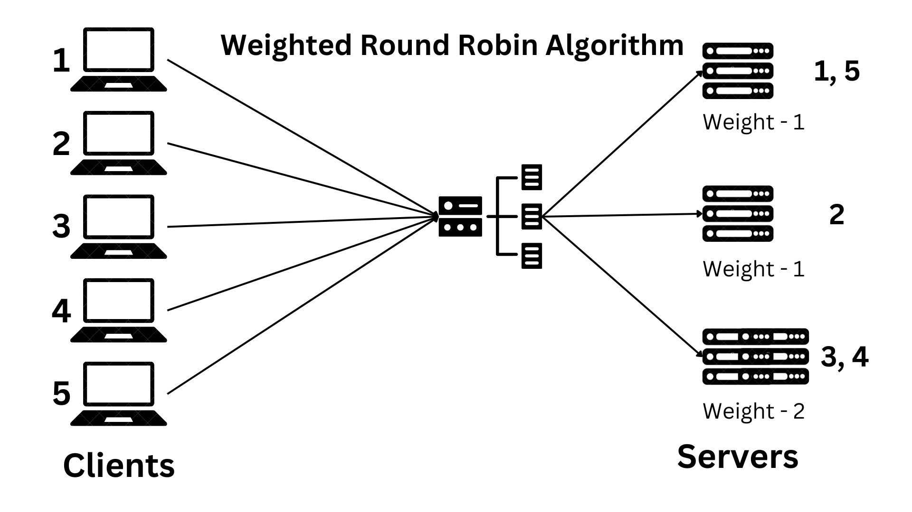
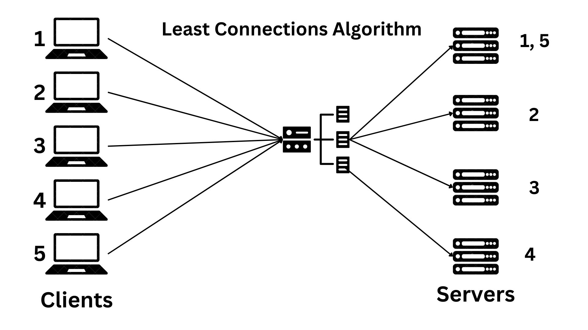

# Load Balancer Algorithms

This project demonstrates various load balancing algorithms using simulation. The goal is to help students and developers understand the functioning of load balancing techniques in a system design context.

---

## Introduction
Load balancing is a critical concept in system design for distributing client requests or network traffic across multiple servers. This ensures no single server is overwhelmed, improving overall system performance and reliability.

This project visualizes four common load balancing algorithms:
1. **Round Robin Algorithm**
2. **Weighted Round Robin Algorithm**
3. **Least Connections Algorithm**
4. **Hash-Based Algorithm**

---

## Algorithms Implemented

### Round Robin Algorithm
Distributes client requests sequentially among servers. This ensures an even distribution of requests across all available servers.



---

### Weighted Round Robin Algorithm
Assigns weights to servers, allowing servers with higher capacities to handle more requests. Requests are distributed based on the weights.



---

### Least Connections Algorithm
Assigns requests to the server with the least number of active connections. This ensures servers with lighter loads are prioritized.



---

### Hash-Based Algorithm
Distributes requests based on a hash value calculated from client or request data (e.g., IP address). This ensures consistent allocation for the same client.

---

## Features
- Customizable number of servers and weights for weighted algorithms.
- Interactive simulation for students and developers to experiment with requests.

---

## Getting Started

### Prerequisites
- Java Development Kit (JDK) 8 or higher
- [Maven](https://maven.apache.org/) (optional, for managing dependencies)
- A code editor like IntelliJ IDEA or Visual Studio Code

### Installation
1. Clone the repository:
   ```bash
      git clone https://github.com/your-username/load-balancer-algorithms.git
   ```

2. Navigate to the project directory:
  ```bash
     cd load-balancer-algorithms
  ```

3. Compile the Java code:
   ```bash
     javac -d bin src/**/*.java
   ```

### Usage

1. Run the main program:
   ```bash
      java -cp bin RoundRobin.Main
   ```

   Follow the console prompts:
  - Input the number of servers.
  - Input requests to simulate the algorithm's behavior.

### Technologies Used

- Java: Core programming language for implementing the algorithms.
- Git: Version control for tracking changes and collaboration.
- Markdown: Documentation formatting.

### Contributing

Contributions are welcome! To contribute:

1. Fork the repository.
2. Create a feature branch (git checkout -b feature-name).
3. Commit your changes (git commit -m "Add new feature").
4. Push to the branch (git push origin feature-name).
5. Open a Pull Request.
